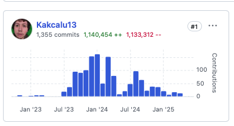

## Kakcalu13 introduction

Click here to view my skills & proficiency

### 💪 Proficient In:
- **Languages:** Python (Professional) • JavaScript (Intermediate) • Bash/CMD (Professional)
- **DevOps:** Docker (Professional) • Git/GitHub (Professional) • GitHub Actions (Advanced)
- **Game Dev:** Godot (Advanced)
- **Simulation model:** XML/SDF

### 🔧 Technologies I've Worked With:
- **Cloud:** Docker • GCloud • AWS • Azure • Kubernetes • Terraform
- **OS:** Linux/Ubuntu/Raspbian/Kali • Windows (XP-11) • macOS (Intel/Apple Silicon)
- **Simulation:** Gazebo • MuJoCo • Webots • Carla
- **Monitoring:** Grafana (API)

### 🤖 Hardware & Robotics:
- **Robots:** Robotic Arms • Drones • Industrial Automation • Toys
- **Boards:** Raspberry Pi • Arduino • Micro:bit
- **Sensors:** IMU • LiDAR • Camera • Microphone • Pressure • LED • EEG • Photoresistors • IR
- **Actuators:** Stepper/DC Motors • Servos (Plastic to Industrial) • Multiple ICs
- **Connectivity:** Ethernet • Network Communication • Multiple Remote Controls • Bluetooth

### 🌱 Currently Learning:
- **AI/ML:** LLM Development • Mizo STT/TTS
- **Mobile:** React • Android Studio • Swifty 
- **Systems:** Rust • Zig • Pony
- **Build:** CMake

### 📝 Worked Briefly:
Swift • Mac Apps • Snapdragon • Ruby

Open source I've worked with

### 🚀 FEAGI Connector Project

**My Impact:** 1,355 commits • 1.5M+ lines • Core package for FEAGI intergration in PIP package

### 🚀 Gazebo issues

**My Impact:** Multiple issues to contribute to improve Gazebo

<!--
**Kakcalu13/Kakcalu13** is a ✨ _special_ ✨ repository because its `README.md` (this file) appears on your GitHub profile.

Here are some ideas to get you started:

- 🔭 I’m currently working on ...
- 🌱 I’m currently learning ...
- 👯 I’m looking to collaborate on ...
- 🤔 I’m looking for help with ...
- 💬 Ask me about ...
- 📫 How to reach me: ...
- 😄 Pronouns: ...
- ⚡ Fun fact: ...
-->
